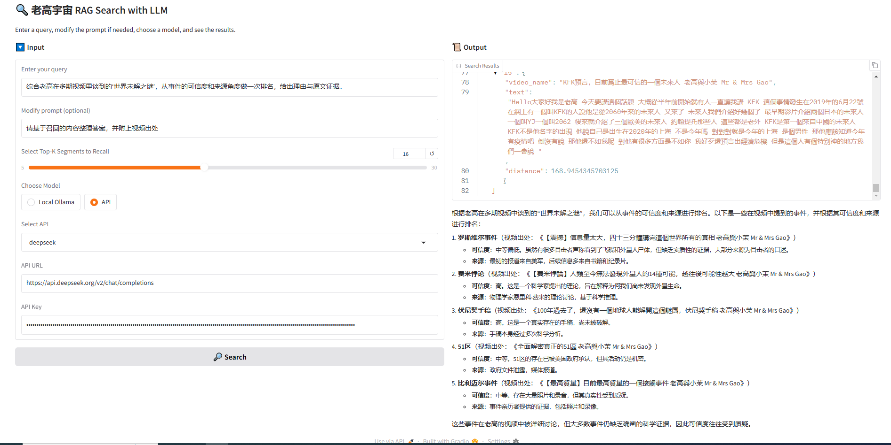

# MrMrsGaoRAG

A project to get all info from YouTube channel "Mr & Mrs Gao" and build a RAG (Retrieval-Augmented Generation) application.



## 🌟 Features
- **Audio Transcription** - Convert YouTube videos to text using Whisper ASR
- **Vector Search** - FAISS index with M3E embeddings for semantic search
- **Multi-LLM Support** - Choose between:
  - Local models via Ollama
  - Cloud APIs (GPT-4/DeepSeek)
- **Interactive UI** - Gradio-based interface with RAG capabilities

## 🛠️ Installation
```bash
# Clone repository
git clone https://github.com/yourusername/MrMrsGaoRAG.git
cd MrMrsGaoRAG

# Install dependencies
pip install -r requirements.txt

# Install Whisper (requires FFmpeg)
brew install ffmpeg  # macOS
# or
sudo apt update && sudo apt install ffmpeg  # Linux
```

## 📁 Project Structure


```
.
├── audios/          # Raw audio files
├── transcribe/      # Whisper JSON transcripts
├── faiss/           # Vector index & metadata
├── query.py         # Main RAG interface
├── transcribe.py    # Audio processing
└── insert_faiss.py  # Index builder
```


## 🧠 How It Works

### RAG Pipeline

1. **Query Processing**
   User input → M3E embedding → FAISS similarity search
2. **Context Augmentation**
   Top-K relevant segments + Original query → LLM prompt
3. **Response Generation**
   Local/Cloud LLM generates final answer with video sources

### Technical Stack

| Component     | Technology               |
| :------------ | :----------------------- |
| Transcription | Whisper Medium (Chinese) |
| Embeddings    | M3E-base                 |
| Vector Store  | FAISS                    |
| LLM Interface | LangChain + Ollama       |
| UI Framework  | Gradio                   |

## ⚠️ Notes

- First run will download ~3GB Whisper model
- GPU recommended for faster transcription
- Edit `split_text()` in `insert_faiss.py` to adjust chunk sizes
- Add API credentials in Gradio UI when using cloud models
